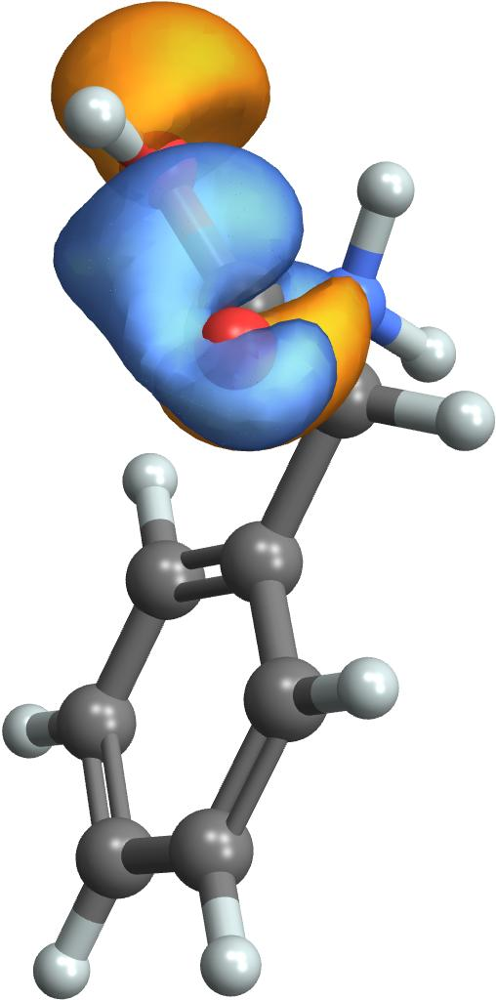

# Plotting_chiral_response
   This package calculates calculates Chiral Population Orbitals

   The input files required are:
- Diagonal elements of the (TDM @ integral_matrix) x6:
  - elec_x.data
  - elec_y.data
  - elec_z.data
  - mag_x.data
  - mag_y.data
  - mag_z.data
- Template molden file with consistent AO indexing
  
  The output files are:
- orb000001.molden file with the corresponding CPA
- orb000001.cub file with the corresponding CPA

  The example corresponds to the second transition of the hydroxyl oxygen K-edge manifold of phenylglycine

## How to Cite

If you use this code in a publication, please cite the paper describing the method:
> Freixas, Victor M., Jérémy R. Rouxel, Sergei Tretiak, Niranjan Govind, and Shaul Mukamel. "Chiral population analysis: a real space visualization of X-ray circular dichroism." Chemical Science (2025).

    
